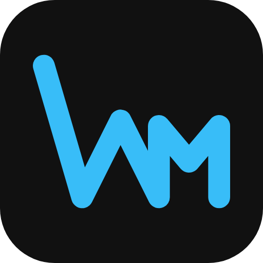

# WriteMind

A writing app: a markdown notebook on the left, a live camera on the right,
and a drawing layer over both. Notes are plain `.md` files in a folder —
nothing here is a database, and nothing rewrites a file the user did not
type in.

## Install on Windows

Download **`WriteMind-Setup-<version>.exe`** from the
[latest release](https://github.com/chere005/WriteMindCross/releases/latest) and run it. It installs for
your Windows user only (no admin prompt) and offers, on one page, to install **Python** and the **Wolfram
Engine** for runnable cells, and to open the Wolfram activation (you sign in with your own Wolfram ID).
The installer is not code-signed yet, so Windows SmartScreen asks first: **More info ▸ Run anyway**.
Installed copies check for updates on startup (Help ▸ Check for Updates…). Details:
[docs/INSTALL-WINDOWS.md](docs/INSTALL-WINDOWS.md).

## Install on macOS

From the same [latest release](https://github.com/chere005/WriteMindCross/releases/latest), download
**`WriteMind-<version>-mac-arm64.dmg`** for Apple silicon (About This Mac says **Chip**: Apple M…) or
**`WriteMind-<version>-mac-x64.dmg`** for an Intel Mac; macOS 13 Ventura or newer. Open it and drag
WriteMind onto Applications (it replaces an older WriteMind there). It is signed ad hoc and not
notarized (no Apple Developer ID yet), so the first open needs a yes: on macOS 15 / 26, open it, click
**Done**, then System Settings ▸ Privacy & Security ▸ **Open Anyway**; on macOS 13 / 14, Control-click ▸
**Open**. Help ▸ Check for Updates… tells you when there is a newer version and opens its download page.
Details: [docs/INSTALL-MAC.md](docs/INSTALL-MAC.md).

## The code

**This repo is the cross-platform WriteMind: macOS, Windows and Linux,
one codebase.** The macOS-only Swift app it was ported from is in `WriteMind/`
as a reference, and its living copy is `~/GIT/WriteMind`.

- `docs/PORT.md` — what was ported, what was rebuilt, and why CodeMirror
- `docs/BUILDING.md` — the build, the three packages, and Arch in
  particular
- `docs/TODO.md` — what is left
- `docs/TESTING.md` — typecheck, unit tests and the end-to-end suites
  (`npm run e2e`)
- `AGENTS.md` — how the code is put together (the Mac app's own rules are
  in there too, and they are still the rules: they were never about AppKit)

```sh
npm install
npm test        # the ported model, against the transcribed Swift suite
npm run dev     # the app
```


---

## The macOS app this came from

# WriteMind



A macOS writing app: markdown notes on the left, a live camera on the right.
Photograph a notebook page and the writing comes onto the page as ink, as a
picture, or as text; draw over it, sketch a flow chart, and the notes stay
plain `.md` files in `~/Documents/WriteMind`.

- [What it does](docs/FEATURES.md) — the whole tour
- [AGENTS.md](AGENTS.md) — how the code is put together, and the rules for
  working in it
- [docs/TODO.md](docs/TODO.md) — what is next

macOS 14 or later. No dependencies, no package manager.

```sh
sh tools/setup-signing.sh   # once: a local signing certificate
sh tools/run.sh             # Debug build, then open it
sh tools/test.sh            # the unit suite
sh tools/deploy.sh          # Release into /Applications
```

[Building and shipping](docs/BUILDING.md)
